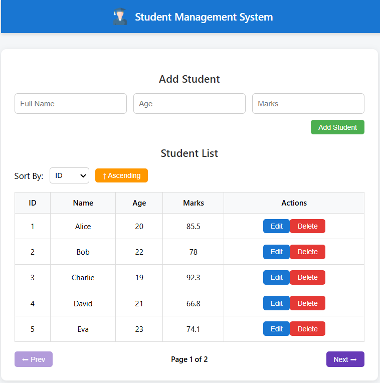
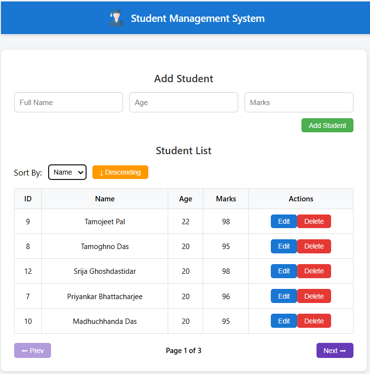
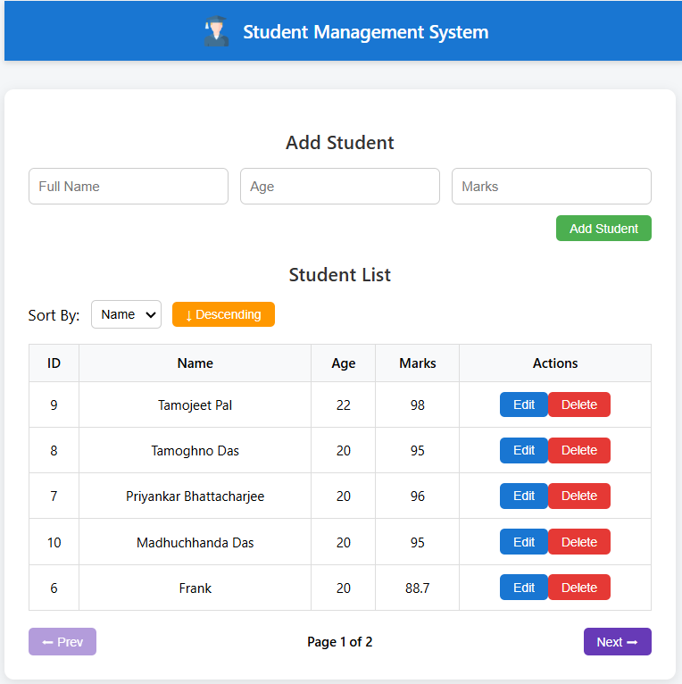
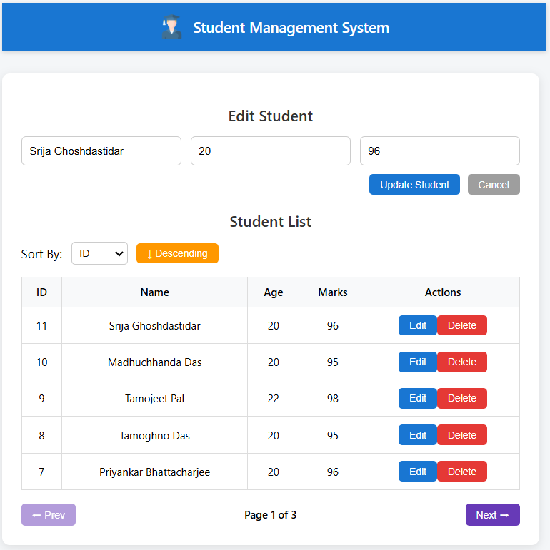
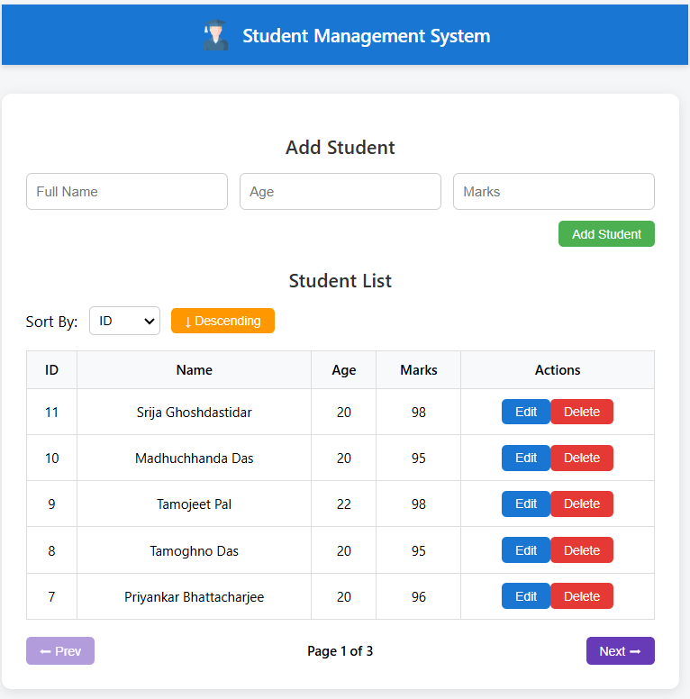
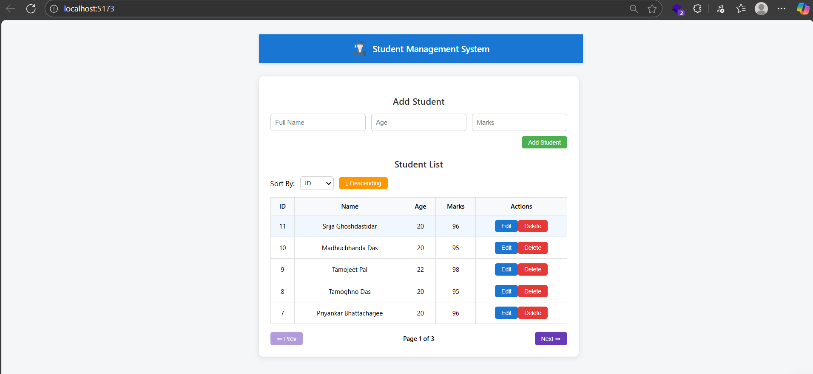
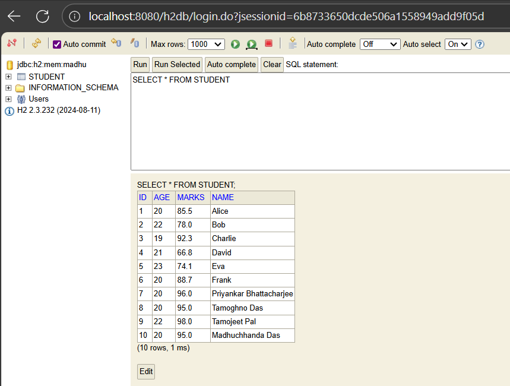

# Student Management System

We developed a **full-stack Student Management System** using **Spring Boot** (backend) and **React with Vite** (frontend).  

- On the **backend**, we created a `Student` entity with fields like **id, name, age, and marks**, and built a **repository → service → controller** flow using **Spring Data JPA** for CRUD operations with **pagination and sorting**.  
- We also seeded sample data into an **H2 in-memory database** and exposed REST APIs:  
  - `GET /students`  
  - `POST /students`  
  - `PUT /students/{id}`  
  - `DELETE /students/{id}`  

- On the **frontend**, we built a **React UI** that allows **adding, editing, updating, deleting, sorting, and paginating students**, styled with a **navbar, logo, gradient background, and colorful buttons**.  

---

## 🛠️ Tech Stack


  


---

## 📂 Project Structure

```plaintext
StudentManagementSystem
├── backend-springboot     # Spring Boot backend
├── frontend-react         # React + Vite frontend
├── images                 # Screenshots of the project
└── README.md              # Project documentation
```

---

## ✨ Features

- Add, update, delete, and view student records
- Pagination and sorting of records
- Responsive React frontend with gradient UI
- RESTful APIs with Spring Boot + Spring Data JPA
- H2 in-memory database with sample seed data

---

## 📸 Screenshots

### 📊 Initial Output  
|  |  
|:--:|  
*Displays the initial student records fetched from the H2 database.*  

---

### 🗂️ Sort by Age (Descending)  
|  |  
|:--:|  
*Students sorted by **age in descending order** using pagination and sorting.*  

---

### 🗂️ Sort by Name (Descending)  
|  |  
|:--:|  
*Students sorted by **name in descending order** dynamically.*  

---

### 🗑️ Delete Record  
|  |  
|:--:|  
*Student record deleted successfully with updated table view. Srija's Record has been deleted which is why it's not appearing in list of names being printed in descending order...*  

---

### ✏️ Update Student Record   

|  |  
|:--:|  
*Student that is to be updated ..Here marks will be updated , changed from 96 to 98 .*  

|  |  
|:--:|  
*Student's marks changed.* 

---

### 🆔 ID Description  
|  |  
|:--:|  
*Table demonstrating student records with ID-based sorting and display.*  

---

### 🛢️ H2 Database View  
|  |  
|:--:|  
*H2 in-memory database console showing stored student records.*  

---


## 🚀 Getting Started

### Backend (Spring Boot) (or Start from IntelliJ run button)
```bash
cd backend-springboot
mvn spring-boot:run
```

API runs at: [http://localhost:8080](http://localhost:8080)

### Frontend (React + Vite)
```bash
cd frontend-react
npm install
npm run dev
```

App runs at: [http://localhost:5173](http://localhost:5173)


Credits : latenightcoder-git

MIT License

© 2025 Madhuchhanda Das
